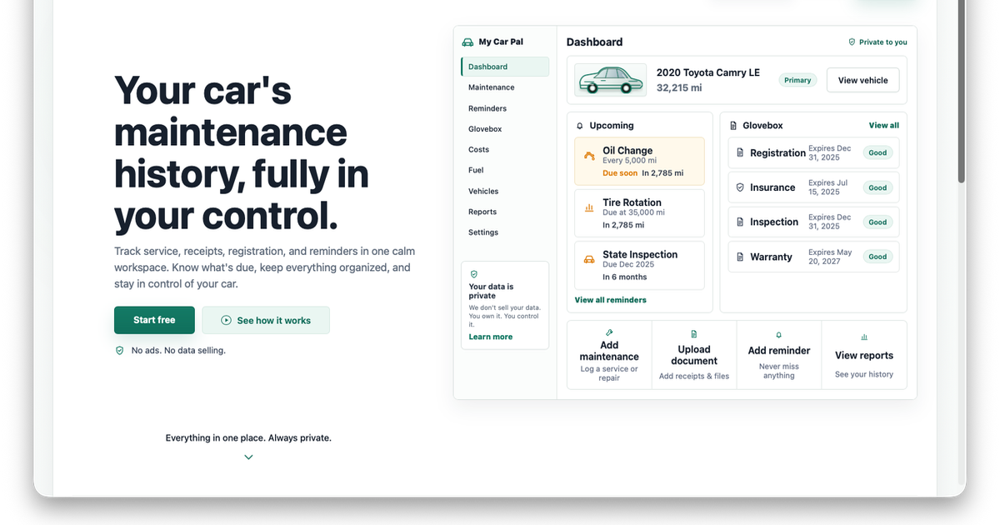

# My Car Pal



**Your car's maintenance history, fully in your control.** Track service, receipts, registration, and reminders in one calm workspace - no ads, no data selling.

[](LICENSE)
[](https://github.com/anthonyarmijo/my-car-pal/actions/workflows/ci.yml)

---

## Hosted Or Self-Hosted

**[mycarpal.app](https://mycarpal.app)** is the premium hosted version with managed billing, sync, and production infrastructure.

Prefer to run it yourself? This repo is the fully self-hostable core - Docker, Postgres, local storage, and no cloud dependencies required.

---

## Features

- **Garage** - Cars, trucks, motorcycles, and scooters with VIN decode and manual entry
- **Maintenance** - Service logs with receipts, manual reminders, and curated schedule imports
- **Glovebox** - Registration, insurance, manuals, and receipts organized in one place
- **Alerts** - Home dashboard with maintenance, registration, and insurance due states
- **DIY Center** - Category-based how-to articles and local mechanic lookup via OpenStreetMap
- **Privacy-first** - No ads, no data selling, no tracking. Your records stay yours.
- **Light + dark mode** - System-aware theme support, including a motion-aware, scroll-driven landing transition and a responsive, theme-matched dashboard preview built from code rather than a static screenshot

---

## Quick Start

**Prerequisites:** Node.js 20+, Docker

```bash
npm install
cp .env.example .env
npm run db:up
npx prisma migrate dev
npm run dev
```

Open [http://localhost:3000](http://localhost:3000), register a local account, and add your first vehicle.

### Docker Stack

```bash
cp .env.example .env
npm run docker:up
```

The Docker stack includes the app, Postgres, and Adminer on port 8080.

---

## Stack

Next.js 15 · TypeScript · Prisma · PostgreSQL · Better Auth · Docker

Local file storage by default. Optional adapters are available for social auth and managed storage.

---

## Quick Start (Development)

```bash
git clone https://github.com/anthonyarmijo/my-car-pal.git
cd my-car-pal
cp .env.example .env
docker compose up -d
npm ci && npx prisma migrate dev && npm run dev
```

See [docs/dev/](docs/dev/) for detailed setup.

---

## Links

| | |
|---|---|
| Website | [mycarpal.app](https://mycarpal.app) |
| Contributing | [CONTRIBUTING.md](CONTRIBUTING.md) |
| Security | [SECURITY.md](SECURITY.md) |
| Changelog | [CHANGELOG.md](CHANGELOG.md) |
| License | [AGPL-3.0](LICENSE) |
| Development docs | [docs/dev/](docs/dev/) |
