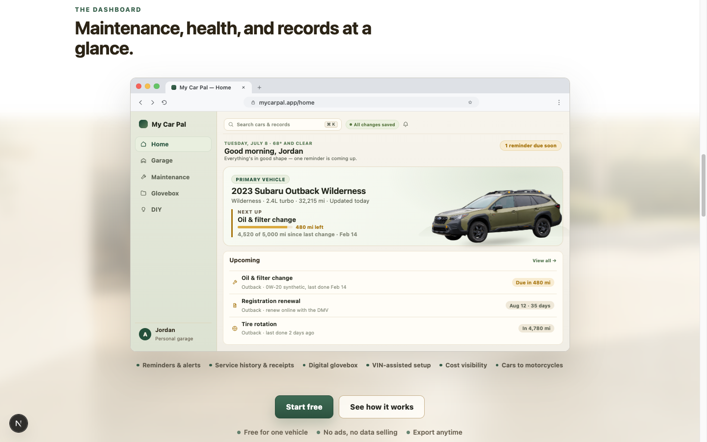

# My Car Pal



My Car Pal is an open-source, privacy-forward vehicle maintenance app for organizing vehicles, service history, reminders, documents, and DIY resources. Run it yourself with Docker and PostgreSQL, or choose the hosted service for a managed setup.

[](LICENSE)
[](https://github.com/anthonyarmijo/my-car-pal/actions/workflows/ci.yml)

## What You Can Manage

- **Garage** — Keep cars, trucks, motorcycles, and scooters together with VIN-assisted or manual setup.
- **Maintenance** — Record service history and receipts, create reminders, and import supported maintenance schedules.
- **Digital glovebox** — Organize registration, insurance, manuals, and other vehicle documents.
- **Alerts** — See maintenance, registration, and insurance due states in one dashboard.
- **DIY resources** — Browse practical how-to articles and find nearby mechanics using OpenStreetMap.
- **Your data** — No ads or data selling. Self-host locally and export your records when you choose.

## Choose How to Run It

### My Car Pal Cloud

[My Car Pal Cloud](https://mycarpal.app) is hosted and maintained for you, with sync and backups handled by the service. It is free for one vehicle and requires no credit card.

### Self-host My Car Pal

This repository contains the free, self-hostable application. It runs with Node.js, PostgreSQL, and local file storage, with no managed hosting provider required. See the [self-hosting guide](SELF_HOSTING.md) for production configuration and upgrades.

## Quick Start

**Requirements:** Node.js 20.x, npm 10+, Docker, and Git.

```bash
git clone https://github.com/anthonyarmijo/my-car-pal.git
cd my-car-pal
cp .env.example .env
npm ci
npm run db:up
npx prisma migrate dev
npm run dev
```

Open [http://localhost:3000](http://localhost:3000), create a local account, and add your first vehicle.

To run the complete Docker stack instead, use `npm run docker:up`. It starts the application, PostgreSQL, and Adminer on port 8080.

## Technology

Next.js 15 · TypeScript · Prisma · PostgreSQL · Better Auth · Docker

Local file storage is the default. Social authentication and managed storage remain optional integrations.

## Documentation

- [Self-hosting](SELF_HOSTING.md)
- [Contributing](CONTRIBUTING.md)
- [UI architecture](docs/ui-architecture.md)
- [Security policy](SECURITY.md)
- [Support](SUPPORT.md)
- [Changelog](CHANGELOG.md)
- [AGPL-3.0 license](LICENSE)
